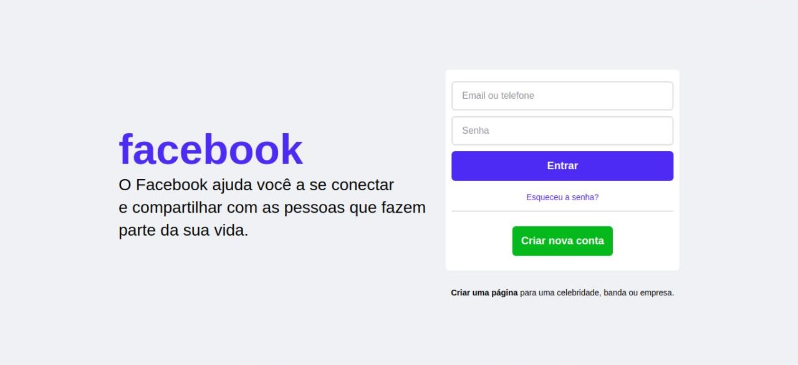

# Clone da Tela de Login do Facebook

### Objetivo: recriar a tela de Login do Facebook com HTML e CSS, colocando em prática conceitos de posicionamento com a tecnologia FlexBox.

### Resultado:

  

